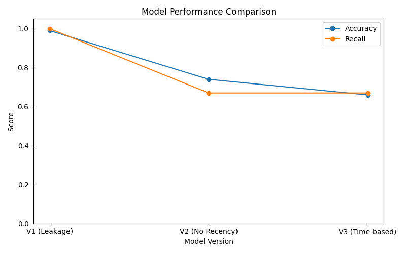
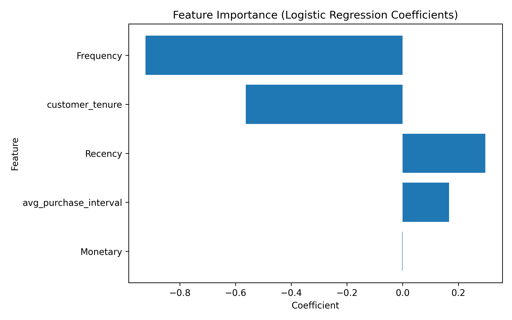
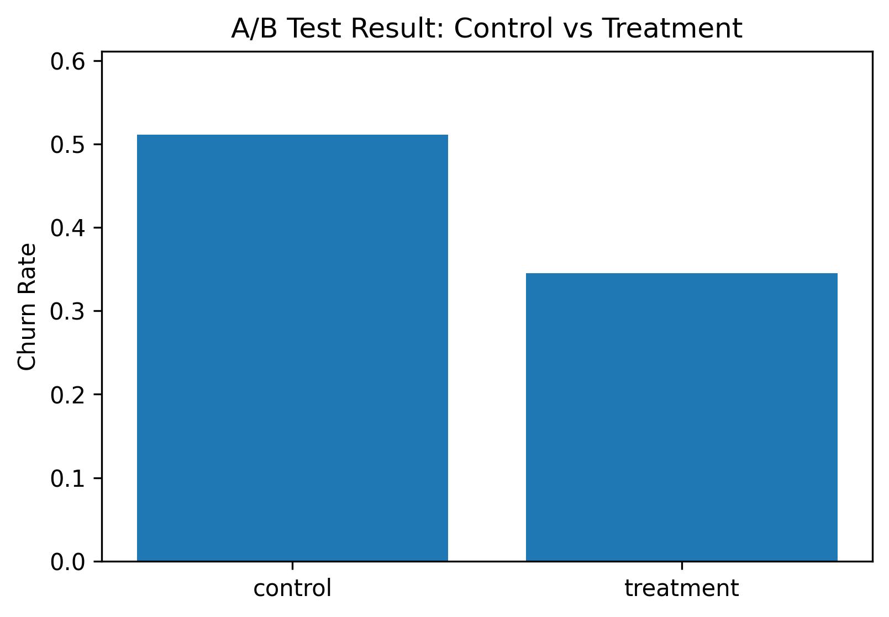

# 📊 AI-Powered Customer Retention Analytics

## 📌 Overview

This project builds an end-to-end customer retention analytics system that predicts customer churn using transactional data and connects predictions to actionable retention strategies.

Starting from basic RFM analysis, the project evolves into a machine learning pipeline and addresses a critical issue in modeling — **data leakage** — by redesigning the dataset using a time-based approach.

---

## 🎯 Objective

* Predict customers who are likely to churn
* Identify key behavioral drivers of churn
* Segment customers based on risk levels
* Design retention strategies based on model outputs

---

## 📂 Dataset

* **Online Retail Dataset**
* Transaction-level customer purchase data

---

## 🏗️ Project Pipeline

```text
Raw Data
→ Data Preprocessing
→ Feature Engineering
→ Churn Labeling
→ Model Training
→ Churn Prediction
→ Risk Segmentation
→ Retention Strategy
→ A/B Test Simulation
```

---

## ⚙️ Data Processing

### 1. Data Preprocessing

* Removed missing CustomerID
* Filtered invalid transactions (Quantity ≤ 0, UnitPrice ≤ 0)
* Converted InvoiceDate to datetime
* Created Sales feature

**Output:**

```
data/processed/cleaned_retail.csv
```

---

### 2. Feature Engineering

Customer-level features were created:

* Recency
* Frequency
* Monetary
* customer_tenure
* avg_purchase_interval

**Output:**

```
data/processed/customer_features.csv
```

---

## ⚠️ Initial Approach & Problem (Data Leakage)

Churn was initially defined as:

```
Recency > 90 → churn = 1
```

However, **Recency was also used as an input feature**, leading to data leakage.

### Result:

* Accuracy ≈ 0.99 ~ 1.00
* Unrealistically perfect predictions

To validate this, Recency was removed and the model was retrained:

* Accuracy dropped to ~0.74

This confirmed that the model was relying on leakage rather than learning real patterns.

---

## 🔁 Solution: Time-Based Data Design

### Key Idea

```
Past data → Feature generation  
Future data → Churn labeling
```

---

### Step 1: Snapshot Definition

```
snapshot_date = 2011-09-01
```

---

### Step 2: Data Split

* Past Data → used for feature generation
* Future Data → used for churn labeling

```
data/processed/past_data.csv
data/processed/future_data.csv
```

---

### Step 3: Feature Generation (Past Only)

```
data/processed/past_customer_features.csv
```

---

### Step 4: Future-Based Churn Label

Customers are labeled as churn if they do not purchase within 90 days after the snapshot date.

An earlier version of churn labeling (`create_churn_label.py`) was used in a baseline experiment that included data leakage.  
The final pipeline uses `create_future_churn_label.py` to generate time-based labels without leakage.

```
data/processed/time_based_labeled_dataset.csv
```

---

## 🤖 Model Training

### Models Used

* Logistic Regression
* Random Forest

---

## 📊 Model Comparison

| Version | Setup                                 | Accuracy | Recall (Churn) | Insight         |
| ------- | ------------------------------------- | -------- | -------------- | --------------- |
| V1      | Recency-based label + Recency feature | ~0.99    | ~1.00          | Data leakage    |
| V2      | Recency-based label without Recency   | ~0.74    | ~0.67          | Validation step |
| V3      | Time-based dataset                    | **0.66** | **0.67**       | Realistic model |



---

## 📈 Final Results

### Logistic Regression

* Accuracy: **0.66**
* Recall (churn): **0.67**
* ROC-AUC: **0.72**

### Random Forest

* Accuracy: 0.62
* Recall (churn): 0.52

Logistic Regression was selected as the final model.

---

## 📈 Feature Insights



* High Recency → higher churn risk
* Low Frequency → higher churn risk
* Short tenure → higher churn risk
* Long purchase interval → higher churn risk

Low engagement customers are more likely to churn.

---

## 🎯 Risk Segmentation

Customers are classified based on churn probability:

* 0.0–0.5 → Low Risk
* 0.5–0.6 → Medium Risk
* 0.6–0.7 → High Risk
* 0.7+ → Very High Risk

---

### Current Distribution (Test Set)

The following distribution is based on the logistic regression prediction results from the test set, not the full customer population.

* Low Risk: 339
* Medium Risk: 148
* High Risk: 132
* Very High Risk: 45

---

## 💡 Retention Strategy

### High-Risk Customers

* Discount coupons
* Personalized recommendations

### Medium-Risk Customers

* Reminder emails
* Product suggestions

### Low-Risk Customers

* General engagement strategies

---

## 🧪 A/B Test Simulation

### Objective

To validate whether targeting high-risk customers with retention strategies can effectively reduce churn.

---

### Experiment Design

* Target: Top 30% customers by churn probability
* Control: no action
* Treatment: retention strategy applied (simulated)
* Assumption: churn probability reduced by **8%p**

---

### Result

| Group     | Customers | Churn Rate |
| --------- | --------: | ---------: |
| Control   |        99 |      72.7% |
| Treatment |       100 |      56.0% |

* Absolute Lift: **16.7%p decrease**
* Relative Improvement: **23.0% improvement**

---

### Statistical Significance

* p-value: 0.013

The result is statistically significant (p < 0.05).

---

### Visualization



---

### Interpretation

Retention strategies targeting high-risk customers can significantly reduce churn.

This project connects prediction results to real business decision-making validation.

---

### Note

This experiment is based on simulation, not real campaign data.

---

## 📁 Project Structure

Some directories (e.g., `notebooks/`, `models/`, `config/`) are reserved for future extensions such as experimentation, model persistence, and configuration management.

```
customer-retention-ai/
│
├── data/
│   ├── raw/
│   │   └── online_retail.csv
│   │
│   └── processed/
│       ├── cleaned_retail.csv
│       ├── customer_features.csv
│       ├── past_data.csv
│       ├── future_data.csv
│       ├── past_customer_features.csv
│       ├── time_based_labeled_dataset.csv
│       ├── logistic_churn_predictions.csv
│       └── rf_churn_predictions.csv
│
├── scripts/
│   ├── preprocess.py
│   ├── feature_engineering.py
│   ├── create_time_based_dataset.py
│   ├── create_past_features.py
│   ├── create_future_churn_label.py
│   ├── train_model.py
│   ├── simulate_ab_test.py
│   └── visualize_results.py
│
├── outputs/
│   ├── model_performance_comparison.png
│   ├── feature_importance_logistic.png
│   ├── ab_test_customers.csv
│   ├── ab_test_summary.csv
│   └── ab_test_result.png
│
├── notebooks/
├── models/
├── config/
│
├── README.md
├── requirements.txt
└── .gitignore
```

---

## 🧠 Key Takeaways

1. Data leakage can significantly distort model performance
2. Time-based dataset design is essential
3. Customer behavior is a strong predictor of churn
4. Machine learning outputs should be connected to business actions
5. A/B testing enables validation of data-driven strategies

---

## 🚀 Tech Stack

* Python (pandas, numpy)
* scikit-learn
* statsmodels
* matplotlib
* Git & GitHub

---

## 📌 Conclusion

This project demonstrates the transition from basic data analysis to a production-style machine learning pipeline.

It not only predicts churn but also validates retention strategies through simulation, bridging the gap between machine learning and real-world decision-making.

## 🚀 How to Run

### 1. Clone repository
git clone https://github.com/hyunsung6608/customer-retention-ai.git
cd customer-retention-ai

### 2. Install dependencies
pip install -r requirements.txt

### 3. Run data preprocessing
python scripts/preprocess.py

### 4. Feature engineering
python scripts/feature_engineering.py

### 5. Create time-based dataset
python scripts/create_time_based_dataset.py

### 6. Create past features (leakage prevention)
python scripts/create_past_features.py

### 7. Create churn label (future window)
python scripts/create_future_churn_label.py

### 8. Train model
python scripts/train_model.py

### 9. Run A/B test simulation
python scripts/simulate_ab_test.py

### 10. Generate visualizations
python scripts/visualize_results.py